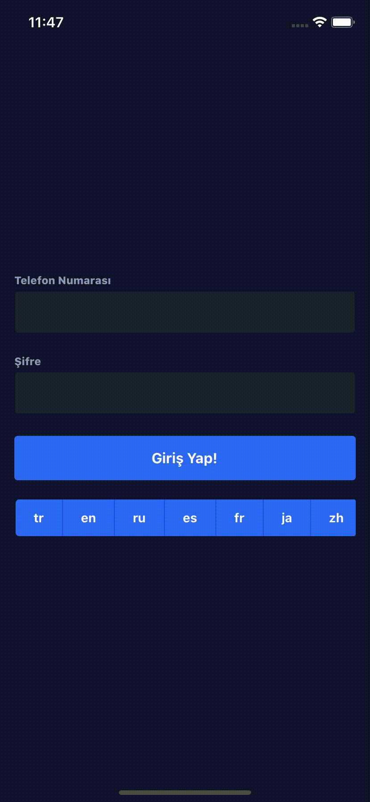
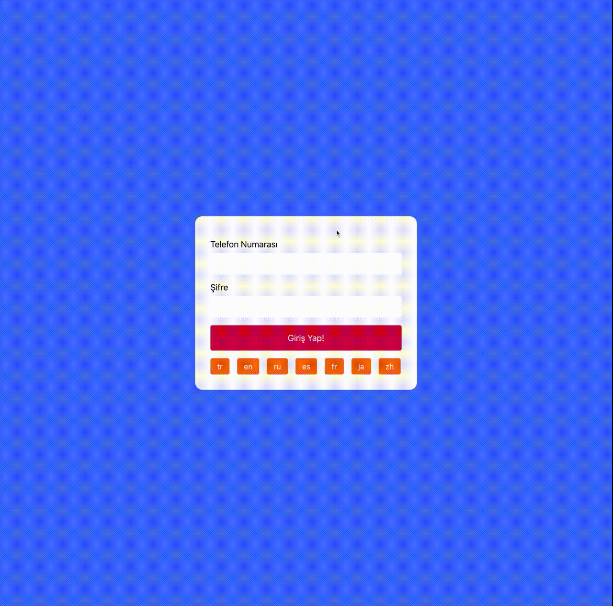

# context-multi-language

This library is provide Multi Language System for React and React Native.

## Installation

```terminal
yarn add context-multi-language
```

```terminal
npm install context-multi-language
```

## Usage

#### TranslationsProvider

```js
<TranslationsProvider
  remoteTranslationsUrl={remoteTranslationsUrl}
  defaultLocale="tr"
/>
```

| Prop                  | Type   | Default            | Description                       |
| --------------------- | ------ | ------------------ | --------------------------------- |
| translations          | object | undefined          | Translations data                 |
| remoteTranslationsUrl | string | undefined          | Remote translations data endpoint |
| defaultLocale         | string | tr                 | default language                  |
| errorComponent        | FC     | TranslationsError  | Default error component.          |
| loadingComponent      | FC     | TranslationLoading | Default loading component.        |
| children              | FC     |                    | TranslationsProvider's children.  |

#### useTranslations

```js
const { t, changeLanguage, languages } = useTranslations();
```

| Prop           | Type     | Description                  |
| -------------- | -------- | ---------------------------- |
| t              | object   | Provide translations data.   |
| changeLanguage | function | Change exist language.       |
| languages      | array    | Exist translation languages. |


## Samples

```js
import { TranslationsProvider, useTranslations } from 'context-multi-language';

const remoteTranslationsUrl = 'https://raw.githubusercontent.com/burhanyilmaz/translations/master/locales.json';

export default () => (
    <TranslationsProvider remoteTranslationsUrl={remoteTranslationsUrl} defaultLocale='tr'>
      <HomeScreen />
    </TranslationsProvider>
);

// or

const translations = {
  "languages": ["en"],
  "translations": {
    "en": {
      "password": "Password",
      "phoneNumber": "Phone Number",
      "signIn": "Sign in!"
    },
}

export default () => (
    <TranslationsProvider translations={translations} defaultLocale='tr'>
      <HomeScreen />
    </TranslationsProvider>
);
```

```js
const HomeScreen = () => {
  const { t, changeLanguage, languages } = useTranslations();

  return (
    <SafeAreaView style={styles.fill}>
      <StatusBar barStyle="light-content" />
      <Input label={t.phoneNumber} />
      <Space />
      <Input label={t.password} secureTextEntry />
      <Space />
      <Button size="large">{t.singIn}</Button>
      <Space />
      <ButtonGroup>
        {languages.map((language) => (
          <Button
            key={language}
            size="tiny"
            onPress={() => changeLanguage(language)}
          >
            {language}
          </Button>
        ))}
      </ButtonGroup>
    </SafeAreaView>
  );
};
```

## SS

### React Native Mobile



### React Web



## Contributing

Pull requests are welcome. For major changes, please open an issue first to discuss what you would like to change.

## License

[MIT](https://choosealicense.com/licenses/mit/)
